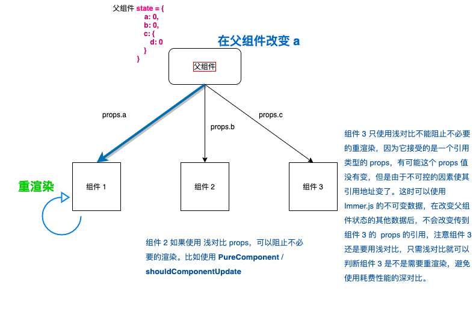

这个测试项目同时测试了 `shouldComponentUpdate`、`PureComponent`、`Immer.js`



得出如下结论：

1. 可以看到使用方法1, 我们只是改变了组件 1 接收的a，但是组件1 和组件 2 、组件 3 都发生重新渲染了，对于组件 2 ，我们只有在组件 2 使用 shouldComponentUpdate 或者 PureComponent 才能阻止组件 2 做不必要的重新渲染：

```js
shouldComponentUpdate(nextProps) {
  if (nextProps.b !== this.props.b) return true
  return false
}
```
2. 对于组件 3，使用方法 1 会导致组件 3 重新渲染，因为方法 1 中 p.c 我们赋值了一个新的对象。组件 3 虽然使用了 PureComponent，但只是浅对比，对于引用类型的 props，虽然值一样，但是引用地址不同，所以重新渲染了。<br/>
对比组件 2，如果我们在组件 2 中使用 PureComponent, 是不会让其重新渲染的，因为组件 2 接收的是一个基本类型的 props，浅比较确定前后是一个相同的 props，所以不用重新渲染。

3. React 中，作为子组件的类组件如果不使用 PureComponent 或者 shouldComponentUpdate ，那么无论接收到的 props 是否改变，父组件每次重新渲染都会引起子组件重新渲染;

4. 使用 immer.js 的目的是，可以让父组件状态中的一些引用类型的数据的引用不变，从而让子组件可以不用深度递归比较新老 props 耗费性能，就可以通过浅对比引用来决定是否重新渲染。这样就减少了子组件对比 props 的计算量，提高性能。<br/>
所以 immer.js 在 React 还是要配合浅对比来使用，比如 PureComponent 或者 shouldComponent 浅对比：

```js
    shouldComponentUpdate(nextProps) {
      if (nextProps !== this.props) return true
      return false
    }
```


